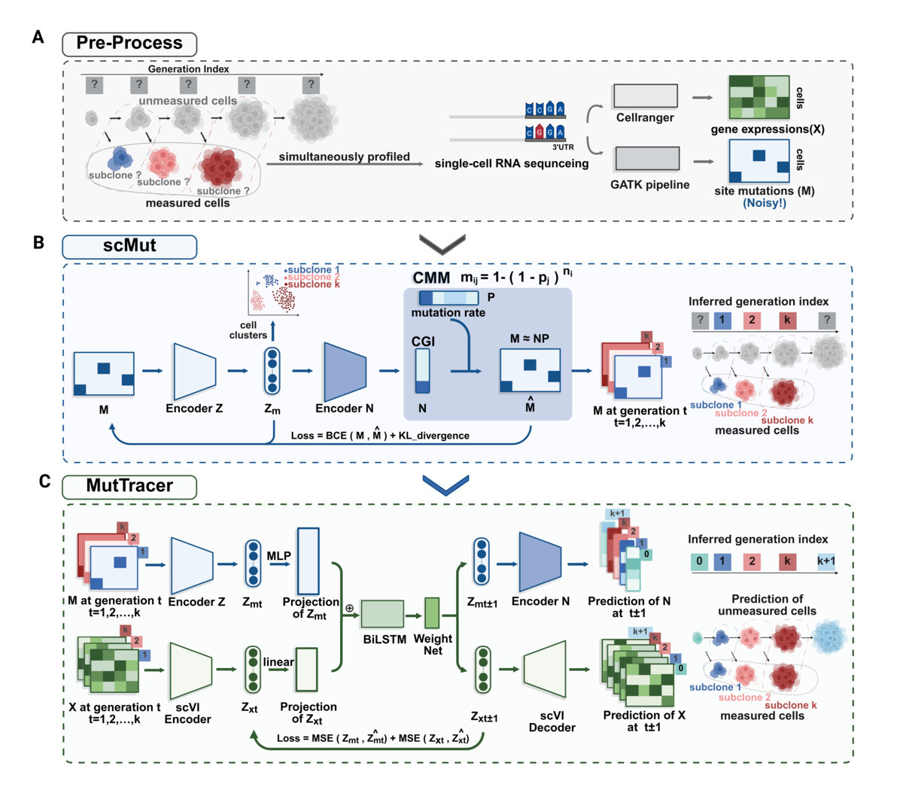

# VAETracer
**Mutation-Guided Lineage Reconstruction and Generational State Inference from scRNA-seq**

***VAETracer*** is a computational framework that integrates somatic mutation profiles with single-cell RNA sequencing (scRNA-seq) data to reconstruct lineage relationships and infer generational dynamics. It consists of three modular components: `preprocess`, `scMut`, and `MutTracer`, implementing end-to-end analysis from raw sequencing data to lineage-aware expression modeling.



## 1. Environment Installation

### 1. preprocess: 
For upstream data processing (FASTQ generation, alignment, variant calling), we need to install core tools including STAR, GATK, samtools, vcftools, and Python packages pysam, pyarrow, pyranges.
```bash
conda create -n sc_preprocess -c conda-forge -c bioconda \
    gcc gxx pigz 'bash=5' 'python=3.7' \
    'samtools' \
    'vcftools' \
    'gatk4==4.2.3.0' \
    'star==2.7.6a' \
    'sra-tools==3.2.0' \
    pandas pysam pyarrow pyranges

conda activate sc_preprocess
```

Note:
- To enable SRA file conversion, please also install `sra-tools`.
- `cellranger` is required and must be downloaded and installed manually from the 10x Genomics website.
- `bash=5` is required for enhanced functionality of the `wait` command used in workflow scripts.
- `gcc`/`gxx`: in case the system's built-in compiler is too old
- `pigz`: parallelly gzip/gunzip
- We recommend **maintaining version consistency** across installations to avoid bugs caused by changes in command-line arguments or usage patterns.

### 2. scMut: 
For running scMut, only basic scientific Python packages and `PyTorch` are required.
```bash
# Create and activate environment
conda create -n vaetracer python=3.11 -c conda-forge
conda activate vaetracer

# Install PyTorch (example with CUDA 12.4)
conda install -c pytorch -c nvidia \
    pytorch==2.5.1 torchvision==0.20.1 torchaudio==2.5.1 pytorch-cuda=12.4

# Install core dependencies
conda install -c conda-forge numpy pandas scipy scikit-learn matplotlib seaborn tqdm anndata
# Alternatively, you can install via scanpy (which includes most dependencies):
conda install -c conda-forge scanpy

# Alternatively, pip works
```

### 3. MutTracer: 
To use MutTracer, which **additionally depends on `scvi-tools`**, a more specific environment with **Python 3.11+ and CUDA 12+** is required. 
```bash
# 1. install PyTorch, and JAX (with jaxlib) for scvi-tools (choose the correct CUDA version based on your hardware)
# 2. install scvi-tools
# 3. install scanpy 
    
# example (pytorch==2.5.1 and use cuda rather than cpu)
conda create -n vaetracer \
    -c conda-forge -c pytorch -c nvidia -c bioconda \
    'python=3.11' \
    pytorch==2.5.1 torchvision==0.20.1 torchaudio==2.5.1 pytorch-cuda=12.4 \
    scvi-tools "jaxlib=*=*cuda*" jax \
    scanpy

# Alternatively, pip works
```

### Integrated Analysis in the Paper
In our study, we integrated multiple analysis workflows, including single-cell RNA-seq analysis (`scanpy`), lineage tree reconstruction (`Cassiopeia`) and others. To manage complex and conflicting dependencies across these tools, we provide the script `env_split.sh`, which automatically sets up isolated Conda environments:

1) **`vaetracer_vcf`**
    - For upstream data processing (`preprocess`)
    - Dependencies:
`sra-tools`, `samtools`, `vcftools`, `gatk`, `STAR`, `pysam`, `pyarrow` and `pyranges` 
    - `cellranger` must be downloaded and installed manually
    - Recommended version consistency with scripts for compatibility

2) **`vaetracer_vae`** or **`vaetracer_vae_scvi`**
    - For modeling and decomposition (`scMut` or/and `MutTracer`)
    - Dependencies:
`pytorch`, `pyarrow`, `scipy`, `scikit-learn`, `umap-learn,` `scanpy` and others (`scvi-tools`)
    - `pyarrow` for reading output from `preprocess`
    - `scvi-tools` is only required for `MutTracer` and is challenging to install due to numerous dependencies and strict version requirements. Therefore, users should set up the environment according to their specific needs.

3) **`vaetracer_sc`**
    - For downstream analysis with omics data
    - Dependencies:
`scanpy` (for single-cell analysis), `cassiopeia` (for lineage tree construction), and others

This separation ensures reproducibility and flexibility, allowing users to activate the appropriate environment for each task.

### Notes
- We provide `pyproject.toml` for both `scMut` and `MutTracer`. After setting up the environment, install the package locally by running `pip install .` in each project root.

- Due to strict version requirements (e.g., `scvi-tools` requires `JAX` with CUDA 12-13 and Python 3.11+), we recommend using a Python 3.11+ environment and CUDA 12+ for `MutTracer`.

- Some packages, like `scikit-misc` (a scanpy dependency) and `Cassiopeia`, are prone to version conflicts. If issues arise, please refer to specific installation guides or consider manual version pinning.

- In theory, all three modules can be integrated in an environment with a **newer** Python version, but maintaining separate environments offers greater **flexibility** and helps users meet specific requirements. Therefore, users are encouraged to manually create and configure environments according to their needs.


## 2. Test: Validate Installation and Module Integrity

### 1) scMut:

To verify that `scMut` is correctly installed and all dependencies are functional, run the built-in test pipeline. Here shows an example:
```bash
run_test() {
    local method="$1"
    local transpose_flag="$2"
    local display_name="Test ${method} with train_transpose=${transpose_flag}"
    echo "[$(date '+%H:%M:%S')] $display_name started..."
    python << EOF && echo "[$(date '+%H:%M:%S')] $display_name over!"
from scMut import test
test.run_pipe(
    run_model_method='$method',
    n_repeat=1,
    n_cells=100,
    n_sites=100,
    train_transpose=$transpose_flag,
    beta_pairs=[(1, 32, None, None)],
    model_params=dict(num_epochs=1000, num_epochs_nmf=1000, lr=1e-3, beta_kl=0.001, beta_best=0.001),
    train_params=dict(patience=45),
    load_params=dict(batch_size=1000, num_workers=0),
    cpu_time=False
)
EOF
}

# run test
run_test "nmf+vae+ft" False
```

**Note**:
- The pipeline runs three sequential models: **NMF -> VAE -> FT**
- It processes two data types: `simple` and `lineage`. 
- If the script runs without error and outputs results to a directory like `./nmf+vae+ft_YYYYMMDD_HHMMSS/`, your installation works properly. 

More details for scipt and results of this example are saved in the `demo/scMut/` folder. Below is an log from a successful execution:
```text
[16:37:27] Test nmf+vae+ft with train_transpose=False started...
2026-02-11 16:37:32,557 - INFO - (Import) Set NUMEXPR_MAX_THREADS to 15.
2026-02-11 16:37:33,033 - INFO - (Import) Use cuda as default device!
2026-02-11 16:37:33,101 - INFO - Set save_dir as: /path/to/VAETracer/demo/scMut/nmf+vae+ft_20260211_163733
2026-02-11 16:37:33,101 - INFO - Logging configured. Logs will be saved to /path/to/VAETracer/demo/scMut/nmf+vae+ft_20260211_163733/run.log
2026-02-11 16:37:33,102 - INFO - Now run simple data...
2026-02-11 16:37:33,102 - INFO - Now run simple data, 0:(1, 32, None, None) seed=1
2026-02-11 16:37:33,102 - INFO - Set save_dir as: /path/to/VAETracer/demo/scMut/nmf+vae+ft_20260211_163733/simple/0_1
2026-02-11 16:37:34,243 - INFO - Now run nmf...
train epoch: 100%|█████████████████████████| 1000/1000 [00:04<00:00, 237.19it/s]
2026-02-11 16:37:39,296 - INFO - Now run vae...
2026-02-11 16:37:39,297 - INFO - Now run vae-mode1-np...
train epoch:  14%|███▋                       | 137/1000 [00:01<00:12, 69.14it/s]
2026-02-11 16:37:41,279 - INFO - Early stopping at epoch 137
2026-02-11 16:37:41,280 - INFO - Restored best model from epoch 92
2026-02-11 16:37:41,492 - INFO - Now run vae-mode1-xhat...
train epoch:  23%|█████▉                    | 228/1000 [00:00<00:03, 245.79it/s]
2026-02-11 16:37:42,421 - INFO - Early stopping at epoch 228
2026-02-11 16:37:42,422 - INFO - Restored best model from epoch 183
2026-02-11 16:37:47,670 - INFO - Now represent Z by tSNE & UMAP...
2026-02-11 16:37:53,485 - INFO - Now run ft...
2026-02-11 16:37:54,331 - INFO - Finished! Get finetuned N by attribute .N_ft.
train epoch: 100%|█████████████████████████| 1000/1000 [00:06<00:00, 154.38it/s]
2026-02-11 16:38:00,809 - INFO - Finished! Get finetuned P by attribute .P_ft.
2026-02-11 16:38:02,187 - INFO - Done by 0h 0m27s
2026-02-11 16:38:05,802 - INFO - Statistics: {...}
2026-02-11 16:38:05,803 - INFO - Now run lineage data...
2026-02-11 16:38:05,803 - INFO - Now run lineage data, 0:(1, 32, None, None) seed=1
2026-02-11 16:38:05,803 - INFO - Set save_dir as: /path/to/VAETracer/demo/scMut/nmf+vae+ft_20260211_163733/lineage/0_1
2026-02-11 16:38:09,677 - INFO - Now run nmf...
train epoch: 100%|█████████████████████████| 1000/1000 [00:04<00:00, 213.01it/s]
2026-02-11 16:38:14,846 - INFO - Now run vae...
2026-02-11 16:38:14,846 - INFO - Now run vae-mode1-np...
train epoch:  21%|█████▊                     | 214/1000 [00:02<00:08, 96.62it/s]
2026-02-11 16:38:17,062 - INFO - Early stopping at epoch 214
2026-02-11 16:38:17,063 - INFO - Restored best model from epoch 169
2026-02-11 16:38:17,388 - INFO - Now run vae-mode1-xhat...
train epoch:  20%|█████▎                    | 204/1000 [00:01<00:04, 179.67it/s]
2026-02-11 16:38:18,525 - INFO - Early stopping at epoch 204
2026-02-11 16:38:18,527 - INFO - Restored best model from epoch 159
2026-02-11 16:38:23,430 - INFO - Now represent Z by tSNE & UMAP...
2026-02-11 16:38:25,087 - INFO - Now run ft...
2026-02-11 16:38:25,126 - INFO - Finished! Get finetuned N by attribute .N_ft.
train epoch: 100%|█████████████████████████| 1000/1000 [00:06<00:00, 154.41it/s]
2026-02-11 16:38:31,603 - INFO - Finished! Get finetuned P by attribute .P_ft.
2026-02-11 16:38:32,580 - INFO - Done by 0h 0m22s
2026-02-11 16:38:36,027 - INFO - Statistics: {...}
2026-02-11 16:38:36,028 - INFO - Now save all results into /path/to/VAETracer/demo/scMut/nmf+vae+ft_20260211_163733/result.pkl...
[16:38:37] Test nmf+vae+ft with train_transpose=False over!
```

**Runtime Performance**:

The following table summarizes average wall-clock execution times or speed across different data scales:
|   scale   |    NMF    |    VAE    | (NMF)->FT | (VAE)->FT |
|-----------|-----------|-----------|-----------|-----------|
|   0.1k    |           |           |           |           |
|     1k    |           |           |           |           |
|    10k    |           |           |           |           |

These benchmarks were obtained on a standard workstation with:
- OS: Ubuntu 22.04.5 LTS (x86_64)
- CPU: Intel(R) Xeon(R) Gold 6230 CPU @ 2.10GHz
  - Enabled: 8 physical cores, 16 logical threads (Hyper-Threading)
- Memory: 128 GB DDR4 RAM
- GPU: NVIDIA GeForce GTX 1080 Ti (11,264 MiB GDDR5X)
  - Driver Version: 550.144.03
  - CUDA Version: 12.4
- Conditions: up to 1000 training epochs, minibatch size of 1000, 3 random repeats per configuration
- 10k only use `simple` data, because binary lineage data is hard to generate for so many cells

### 2) MutTracer:
*To be added* 


## 3. Usage of VAETracer

### 1) preprocess: Data Preprocessing Pipeline
The preprocessing module converts raw sequencing data into structured mutation profiles for downstream analysis. 

We provide a high-level command-line interface, `preprocess10X`, to streamline the execution of preprocessing steps. This wrapper script acts as a unified dispatcher for all individual tools, ensuring consistent parameter formatting and simplifying workflow management.

> **Note**: Please ensure that the `preprocess/` directory and the `preprocess10X` script reside **in the same parent directory**.

#### Recommended Usage: `preprocess10X`
```bash
# Add VAETracer/ to $PATH and chmod u+x VAETracer/preprocess10X, then run:

# Show help for the main command
preprocess10X --help

# Show help for a specific subcommand
preprocess10X <subcommands> --help

# Example subcommands:
preprocess10X SRAtoFastq --help
preprocess10X RunCellranger --help
preprocess10X RunSTAR --help
preprocess10X RunGATK --help
preprocess10X GetAF --help
```

Alternatively, you can directly invoke the individual Bash/Python scripts located in the `preprocess/`:
```bash
# Add VAETracer/preprocess to $PATH, then run:

# (optional) Convert SRA to FASTQ
bash SRAtoFastq.sh --help

# Fastqs to generate gene expression matrix (GEX) and BAM
bash RunCellranger.sh --help

# Align scRNA-seq maps using STAR
bash RunSTAR.sh --help

# Call variants using GATK best practices
bash RunGATK.sh --help

# Extract allele frequency (AF) matrix from VCF and single-cell BAM
python GetAF.py --help

# Note: 
# All bash scripts include the WAIT_FOR_DATA parameter, allowing users to launch the scripts simultaneously even if the required input data is still being generated. 
# The scripts will automatically wait for the data to become available before proceeding.
```

You can also use `GetAF.py` programmatically in Python:
```python
from preprocess import GetAF

# Define arguments manually, then call the main function
GetAF.main(args)
```

### 2) scMut: Mutation Matrix Decomposition
The `scMut` (single-cell Mutation Parser) module decomposes the 2D mutation profile **M** into two biologically interpretable components:
- **N**: Cell generation index (lineage time)
- **P**: Site-specific mutation rate (mutation bias)

It consists of three submodules:
- `NMF`: Non-negative Matrix Factorization, for initial and best decomposition (gNMF in paper)
- `VAE`: Variational Autoencoder, with two operational modes:
  <pre>
  ● mode1-`np`: 
      ▪ Infers latent representation Z via encoder:        Z = encoder1(M)
      ▪ Encodes Z -> N through a learned transformation:   N = encoder2(Z)
      ▪ Learns P as site-specific parameters:              P = P_site
      ▪ Reconstructs M by combining N and P:               Mhat = f(N, P)

  ● mode2-`xhat`: 
      ▪ Uses standard encoder-latent-decoder structure:    Z = encoder(M)
      ▪ Reconstructs mutation matrix directly:             Mhat = decoder(Z)
  </pre>
- `FT`: Fine-tuning module, for post-hoc refinement of N and P estimates

`scMut` is implemented as a Python API, so it can be used as follows:
```python
# after `pip install /path/to/VAETracer/scMut` or from current directory:
import scMut

# Alternatively, if the package is not installed in PYTHONPATH:
import sys
sys.path.append('/path/to/VAETracer')
import scMut

# Note: Users can also install the package locally by running `pip install .` in the scMut root directory, which allows direct imports without modifying `sys.path`.

# API
# Simulate synthetic data
from scMut import simulate_data, simulate_lineage_data, simulate_lineage_data_segment

# Core model class
from scMut import MutModel

# Save MutModel
from scMut import save_model_to_adata    # save output by AnnData
from scMut import save_model_to_pickle   # save the whole MutModel
from scMut import load_model_from_pickle # load the whole MutModel
from scMut import extract_latent_mu      # save z_m (actually mu of z)

# Run test pipeline
from scMut.test import run_pipe

# Use help(func) in Python to view detailed documentation for each function.
```

### 3) MutTracer: Lineage-Aware Expression Dynamics Modeling
`MutTracer` integrates inferred lineage information with gene expression to predict temporal gene expression patterns along lineages. 

`MutTracer` is implemented in Python and provides both a command-line interface and an API for flexible usage:
```bash
# Add VAETracer to $PYTHONPATH (export PYTHONPATH="$PYTHONPATH:/path/to/VAETracer"), then run:
python -m MutTracer.main --help
# or
PYTHONPATH=/path/to/VAETracer python -m MutTracer.main --help
```

It can also be used programmatically:
```python
# after `pip install /path/to/VAETracer/MutTracer` or from current directory:
import MutTracer as mt

# Alternatively, if the package is not installed in PYTHONPATH:
import sys
sys.path.append('/path/to/VAETracer')
import MutTracer as mt
```

#### Command-Line Usage
```bash
python -m MutTracer.main \
  --scmut_model_path <path_to_scmut_trained_model.pkl> \
  --zmt_path <path_to_zm_dictionary.pt> \
  --zxt_path <path_to_zx_dictionary.pt> \
  --input_times <list_of_input_timepoints> \
  --predict_times <list_of_timepoints_to_predict> \
  --epochs <num_training_epochs> \
  --adata_path <path_to_original_h5ad_file> \
  --scvi_model_path <path_to_scvi_model.pkl> \
  --save_dir <output_directory> \
  [--auto_ancestor] \
  [--real_times_keep <list_of_times>] \
  [--pred_times_keep <list_of_times>]
```

#### Parameter Descriptions
- `--scmut_model_path`  
  Path to a pre-trained scMut model `.pkl` file. Used to initialize the predictor weights.

- `--zmt_path`  
  Path to the mutational latent representation dictionary (`Zm`) saved in `.pt` format. Typically generated by `scMut`.

- `--zxt_path`  
  Path to the transcriptional latent representation dictionary (`Zx`) saved in `.pt` format. Typically generated by `scVI` on normalized scRNA-seq data.

- `--input_times`  
  List of time points to use as **input** for training or prediction. Only data from these time points will be used as the model's known states.

- `--predict_times`  
  List of time points for which MutTracer will predict latent and transcriptional states.

- `--epochs`  
  Number of training epochs to run during model fitting. Default is `500`. Increasing epochs may improve convergence but increases runtime.

- `--adata_path`  
  Path to the original `.h5ad` single-cell AnnData object, used for downstream gene expression alignment and analysis.

- `--scvi_model_path`  
  Path to a pre-trained scVI model `.pkl` file, used to obtain transcriptional latent embeddings and reconstruct expression profiles.

- `--save_dir`  
  Directory to save training results, plots, and predictions. If the folder does not exist, it will be created.

- `--auto_ancestor` (optional flag)  
  Automatically selects the most compact time point as the **ancestral state** for prediction.

- `--real_times_keep` (optional)  
  Subset of real time points to include in filtered visualizations (e.g., t-SNE or N distribution plots).

- `--pred_times_keep` (optional)  
  Subset of predicted time points to include in filtered visualizations.

#### Example Usage
```bash
python -m MutTracer.main \
  --scmut_model_path ./model.pkl \
  --zmt_path ./z_mt.pt \
  --zxt_path ./z_xt.pt \
  --input_times 2 3 \
  --predict_times 1 \
  --epochs 2000 \
  --real_times_keep 2 3 \
  --pred_times_keep 1 \
  --auto_ancestor \
  --adata_path ./scRNAlistep.h5ad \
  --scvi_model_path ./scvi_model.pkl \
  --save_dir ./output
```

This command will train MutTracer using time points 2 and 3 as input, predict states for time point 1, automatically select an ancestral state, and save all results and plots to the specified save_dir.

### 4) tree_util: Lineage tree utilities
Provides utility functions for lineage tree processing and format interoperability:
- Converts between `Newick` string format and `CassiopeiaTree` object
- Fixes common tree format issues to improve stability
- Other utilities: e.g. extracts tree linkage matrix


## 4. Notes and Recommendations
- Due to the complexity of deep learning dependencies (especially `PyTorch`), we recommend installing `CUDA` first using the appropriate command for your system (CPU/GPU) before installing other packages.

- In theory, `PyTorch` maintains backward compatibility, so you can install a `PyTorch` version suitable for your hardware. Here, we have confirmed that `PyTorch=1.12.0` works as expected. If a newer version causes incompatibilities, please downgrade accordingly.

- `Scanpy` has specific Python version requirements, and automatically installed versions (by `conda`) often lead to dependency conflicts. The best approach is to check version compatibility and **manually** specify the appropriate version during installation (for example, `conda install 'scanpy<1.10'` for Python 3.8). The same principle applies to other critical packages (such as `Cassiopeia`) as well.

- The dependency versions listed here are valid as of **January 2026**. Future updates to `scvi-tools` may change its installation requirements; please refer to the official documentation for the latest guidance.

- All codes and scripts have been tested and verified on `Linux` systems (Ubuntu and Red-Hat distributions). Compatibility with other operating systems is not guaranteed.


## 5. For Publication (Under Preparation)
If you are using VAETracer in a research manuscript, please contact the authors for citation details.
A formal citation and BibTeX entry will be available upon publication in a peer-reviewed journal.


For questions, please contact.
